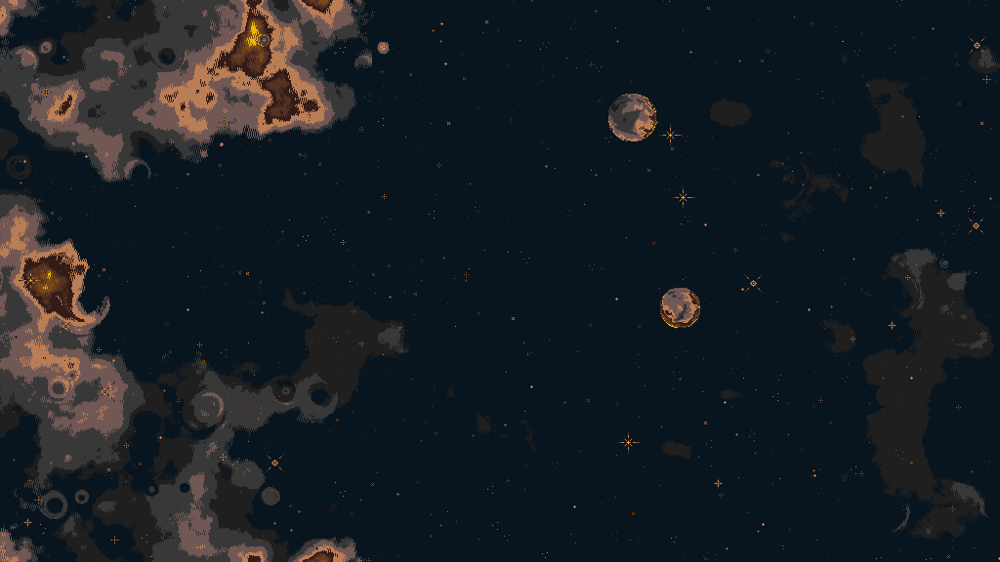
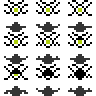
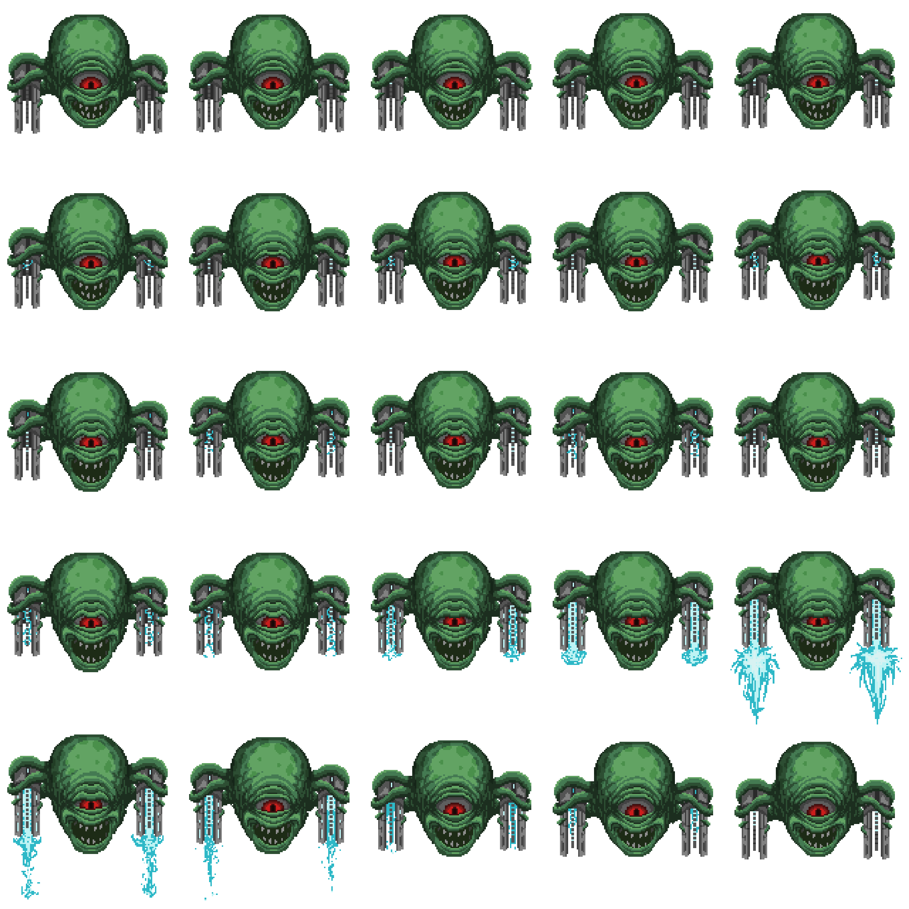
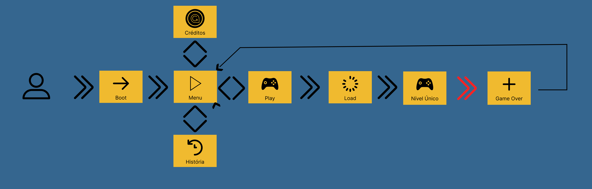
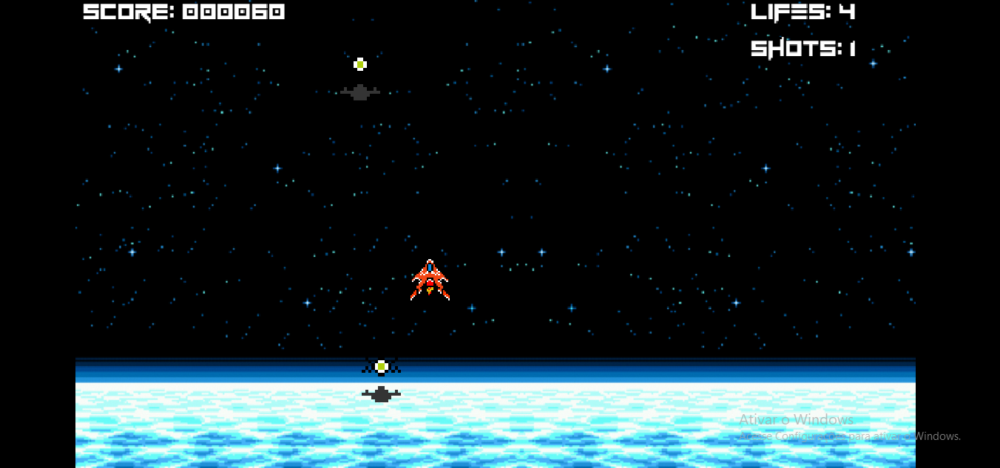
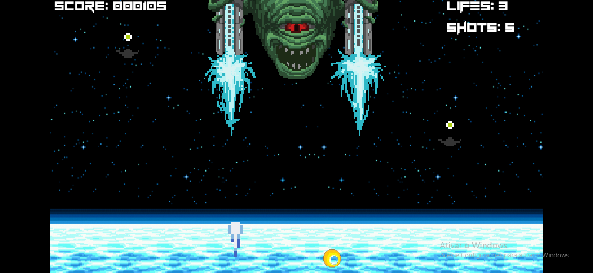
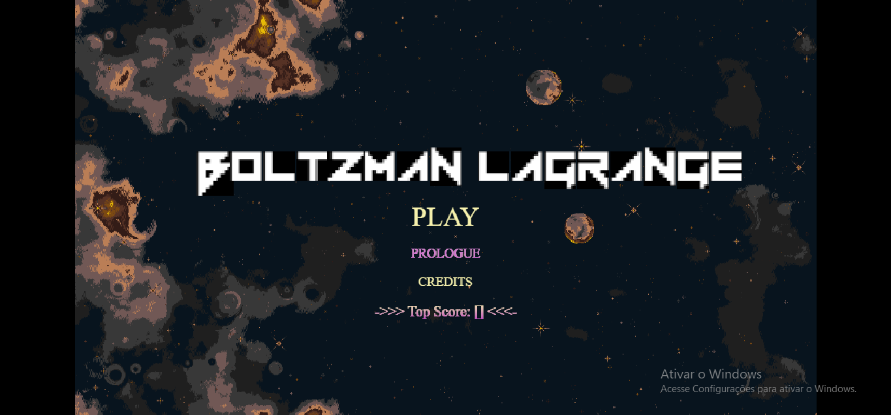
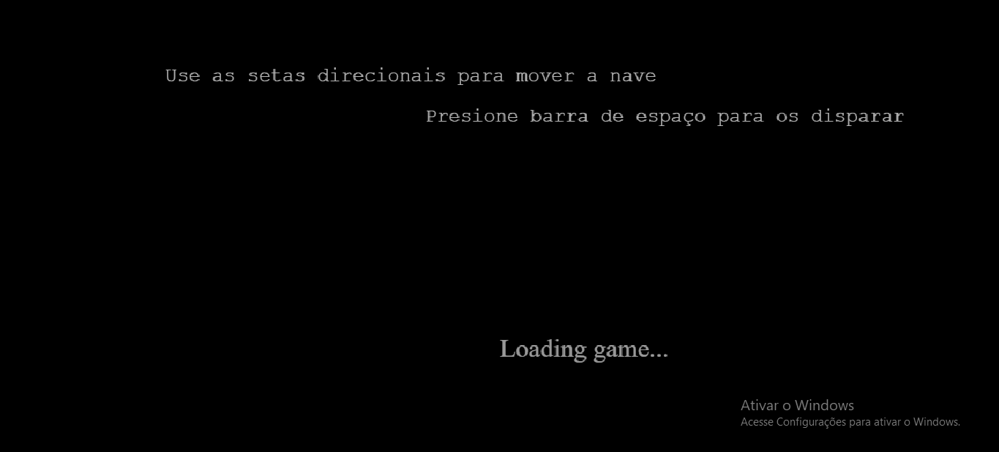
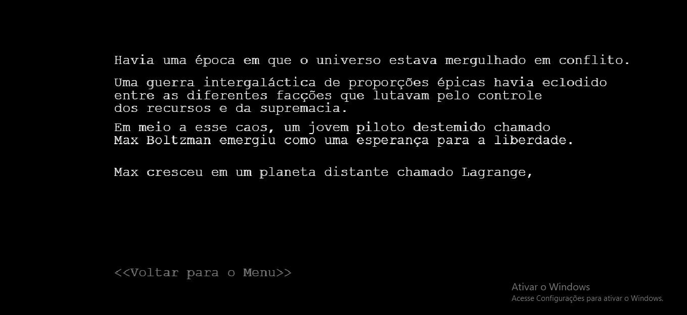
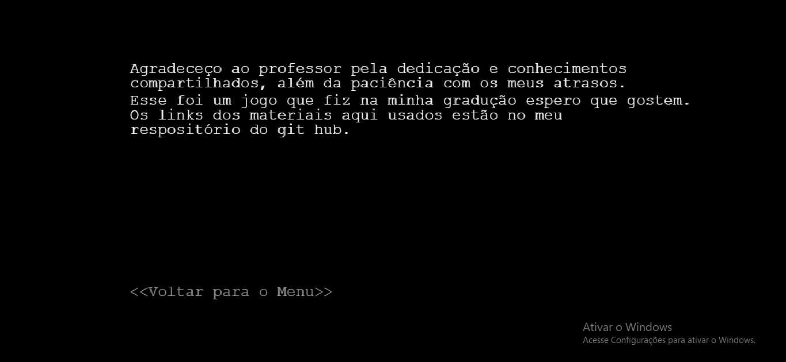

# `<Boltzman Lagrange>`

* Link do jogo: [https://github.com/Jaum0730/Boltzman_Adapta-o-para-phaser/tree/main](https://github.com/Jaum0730/Boltzman_Adapta-o-para-phaser)
* Link da versão final para deploy: [https://github.com/Jaum0730/Parcel_Bolztman.git](https://github.com/Jaum0730/Parcel_Bolztman.git)
* Link do jogo online: [https://parcel-boltzman.vercel.app/](https://parcel-boltzman.vercel.app/)

## Motivação

UM DOS MOTIVOS PARA A CRIAÇÃO É MELHORAR UM PROJETO DO INICIO DA MINHA GRADUAÇÃO O TRANSFORMANDO EM ALGO MAIS ACESSÍVEL

## Objetivo

UM JOGO SIMPLES PORÉM DESAFIADOR PARA JOGAR NO BROWSER

## Valor Agregado

DIFERENTE DE SEU PREDECESSOR AGORA ESSA NOVA VERSÃO SE ENCONTRA DISPONIVEL NO GIT E COM PORTABILIDADE PARA WEB

## Fases

| Fases | Descrição                                                                                     |
| ----- | ----------------------------------------------------------------------------------------------- |
| 1     | O jogo possui apenas uma única fase que só termina quando o boss morre ou a nave é destruida |

## Esquema de Pontuação

Os pontos são ganhos ao acertar inimigos e asteroids.

| Inimigo     | Pontos |
| ----------- | ------ |
| Alien       | 15 pts |
| Alien Chefe | 30 pts |

## Requisitos

### Épicos/Funcionalidades

1. Disparar projeteis com a nave
2. Ver recorde pessoal
3. Gerenciamento de vida e munição

### Personas

1. Persona 
   Nome: Mariana
   Idade: 28 anos
   Localização: Rio de Janeiro
   Ocupação: Desenvolvedora de Software

Descrição:

Mariana é uma desenvolvedora de software apaixonada por jogos web desde a infância. Como uma jovem que cresceu na década de 1990 e os anos 2000 frequentando casas de jogos e lan-houses com seus amigos, e essa paixão permanece até hoje. Mariana aprecia a simplicidade e a jogabilidade envolvente dos jogos de pc, como Ragnarok,  DDTank dentre outros, que lhe proporcionam momentos de descontração e diversão.

Motivações:

* Busca entreterimento casual porém com certa competitividade
* Apreciadora de jogos com gráficos mais modestos puxados para o arcade
* Deseja reviver memórias de adolescência
* Procura jogos que não necessitem de muito tempo livre

Preferências:

* Jogos simples e desafiantes
* Jogos que não durem muito

## Protótipos de Tela

* **Backgrounds**
  Tela Principal

  

  Background do Menu

  

    Imagem gerada por algoritimo feito pelo artista de pixel no seguinte link:[https://deep-fold.itch.io/space-background-generator](https://deep-fold.itch.io/space-background-generator)

* **Sprites de inimigos utilizados**

Spitesheet inimigos padrão

Spritesheet do Boss

Sprites da Nave do Player

autor da arte: [https://opengameart.org/users/awesomeduck?page=1](https://opengameart.org/users/awesomeduck?page=1)

* **Fluxograma para Telas**

* **Gameplay**

* **Navegação**

## Tecnologias e Ferramentas utilizadas

JavaScript: JavaScript é uma linguagem de programação de alto nível, interpretada, baseada em protótipos e multiparadigma. É amplamente utilizada para desenvolver aplicativos web e jogos.

Phaser 3.80: O Phaser é um framework JavaScript de código aberto voltado para a criação de jogos para a web. A versão 3.80 é a mais recente e traz melhorias de desempenho e novos recursos.

HTML: O HTML (Hypertext Markup Language) é a linguagem padrão para a estruturação de páginas web. Ele define o conteúdo e a estrutura básica da aplicação.

Parcel: O Parcel é um empacotador de aplicações web moderno e rápido. Ele ajuda a automatizar tarefas como transpilação, minificação e empacotamento dos arquivos.

Vercel: O Vercel é uma plataforma de hospedagem e implantação de aplicações web. Ela facilita o deploy de aplicações construídas com tecnologias modernas, como o seu projeto.
